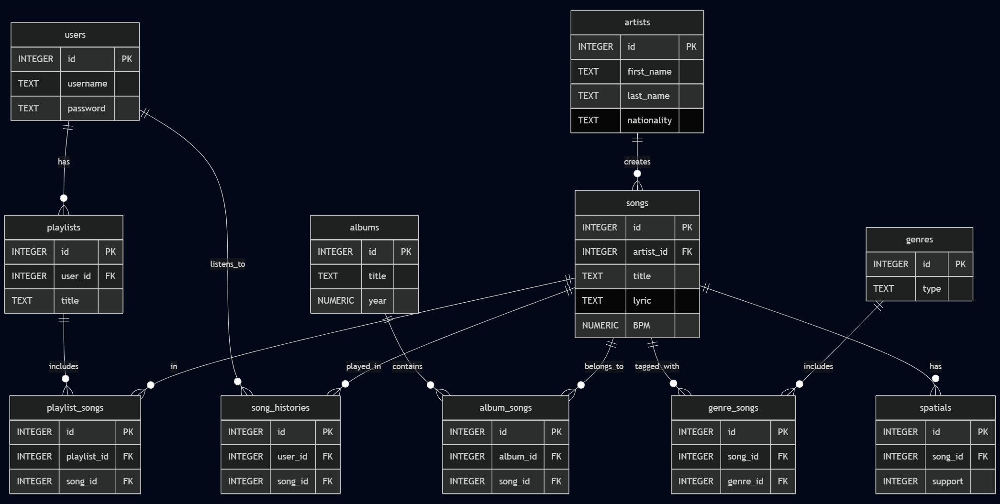

# CS50 SQL - Final Project - Design Document

By Harvest Walukow

Video overview: [Click here](https://youtu.be/Qd6t_4do0nc)

## Scope

* The purpose is to create a structured database that models key aspects of a music streaming service, inspired by Apple Music.
* Key aspects include: users, artists, the music catalog (e.g., songs, albums, genres), and user interactions (e.g., playlists, listening records).
* Excluded: actual audio files, recommendation algorithms, etc.

## Functional Requirements

You can perform CRUD operations on all entities in the database.

## Representation

### Entities

- Represented Entities:
    1.  `users`: Represents the listeners of the music service.
    2.  `artists`: Represents the music creators/performers.
    3.  `albums`: Represents collections of songs released as an album.
    4.  `songs`: Represents individual music tracks.
    5.  `playlists`: Represents user-curated lists of songs.
    6.  `spatials`: Represents information about spatial audio support for songs.
    7.  `playlist_songs`: A junction table linking playlists to songs (Many-to-Many).
    8.  `album_songs`: A junction table linking albums to songs (Many-to-Many).
    9.  `song_histories`: Records a user's listening activity for songs.
    10. `genres`: A predefined list of music genres.
    11. `genre_songs`: A junction table linking songs to genres (Many-to-Many).

- Entity Attributes:
    *   `users`: `id` (INTEGER PK), `username` (TEXT NN), `passwords` (TEXT NN)
    *   `artists`: `id` (INTEGER PK), `first_name` (TEXT NN), `last_name` (TEXT), `nationality` (TEXT NN)
    *   `albums`: `id` (INTEGER PK), `title` (TEXT NN), `year` (NUMERIC NN)
    *   `songs`: `id` (INTEGER PK), `artist_id` (INTEGER FK), `title` (TEXT NN), `release_year` (NUMERIC), `lyric` (TEXT), `BPM` (NUMERIC NN)
    *   `playlists`: `id` (INTEGER PK), `user_id` (INTEGER FK), `title` (TEXT DEFAULT 'Untitled')
    *   `spatials`: `id` (INTEGER PK), `song_id` (INTEGER FK), `support` (INTEGER CHECK(support IN (0, 1)) DEFAULT 0)
    *   `playlist_songs`: `id` (INTEGER PK), `playlist_id` (INTEGER FK), `song_id` (INTEGER FK)
    *   `album_songs`: `id` (INTEGER PK), `album_id` (INTEGER FK), `song_id` (INTEGER FK)
    *   `song_histories`: `id` (INTEGER PK), `user_id` (INTEGER FK), `song_id` (INTEGER FK)
    *   `genres`: `id` (INTEGER PK), `type` (TEXT NN)
    *   `genre_songs`: `id` (INTEGER PK), `song_id` (INTEGER FK), `genre_id` (INTEGER FK)

- Data Type Rationale:
    *   `INTEGER PRIMARY KEY`: Standard for unique, auto-incrementing identifiers in SQLite, ensuring each record is distinct and easily referenced.
    *   `TEXT`: Used for variable-length string data like names, titles, and lyrics, offering flexibility.
    *   `NUMERIC`: Chosen for `year` and `BPM`. SQLite's `NUMERIC` affinity can store integers or real numbers. For these fields, integers are expected.
    *   Foreign Key columns (`artist_id`, `user_id`, etc.) are `INTEGER` to match the `id` columns they reference.

- Constraint Rationale:
    *   `PRIMARY KEY`: To uniquely identify each record within its table, crucial for relationships and efficient lookups.
    *   `NOT NULL (NN)`: To ensure essential data fields (e.g., `username`, `song.title`, `artist.first_name`) are never empty, improving data quality and reliability.
    *   `FOREIGN KEY ... REFERENCES ...`: To maintain relational integrity. This prevents orphaned records (e.g., ensuring a `song_id` in `playlist_songs` actually exists in the `songs` table).
    *   `CHECK(support IN (0, 1))`: To restrict the `spatials.support` column to boolean-like values (0 for false, 1 for true), ensuring data consistency.
    *   `DEFAULT 'Untitled'`: For `playlists.title`, providing a user-friendly default if a title isn't explicitly provided during creation.

### Relationships

- Entity Relationship Diagram and Descriptions:
    *   
    *   (The following describes the key relationships based on the schema in `project.sql`):
    *   **One-to-Many:**
        *   `users` to `playlists`: A user can have many playlists; a playlist belongs to one user.
        *   `users` to `song_histories`: A user can have many song history entries; a history entry belongs to one user.
        *   `artists` to `songs`: An artist is linked to many songs; a song is primarily by one artist in this model.
        *   `songs` to `spatials`: A song has one (or zero) spatial audio record. (Effectively a One-to-Zero-or-One relationship).
    *   **Many-to-Many (via Junction Tables):**
        *   `playlists` and `songs` via `playlist_songs`: A playlist can contain many songs, and a song can be part of many playlists.
        *   `albums` and `songs` via `album_songs`: An album comprises many songs, and a song can appear on multiple albums (e.g., compilations, original album + greatest hits).
        *   `genres` and `songs` via `genre_songs`: A genre can classify many songs, and a song can be associated with multiple genres.

## Optimizations

- Implemented Optimizations and Rationale:
    *   Currently, no specific user-defined indexes (beyond those automatically created by SQLite for `PRIMARY KEY` columns) or views have been implemented in the `project.sql` file.
    *   **Future Consideration - Indexes:** As the database grows and query performance becomes a more critical factor, creating indexes will be a key optimization strategy. Indexes would be considered for:
        *   **Foreign Key Columns:** Columns like `songs.artist_id`, `playlist_songs.playlist_id`, `playlist_songs.song_id`, etc. Indexing these significantly speeds up `JOIN` operations, which are frequent in a relational music database.
        *   **Frequently Searched Columns:** Columns often used in `WHERE` clauses, such as `songs.title`, `artists.first_name`, `albums.title`, `genres.type`, and `users.username`. This allows the database to locate specific records much faster than scanning entire tables.
        *   **Columns in `ORDER BY` or `GROUP BY` clauses:** If queries frequently sort or group data by specific columns, indexing them can prevent costly sorting operations.
        *   **Rationale:** The main purpose of these potential indexes would be to reduce query execution time by enabling the database engine to find data more efficiently, avoiding full table scans.
    *   **Future Consideration - Views:** Views could be created in the future to simplify complex or frequently used queries, such as a view that combines song, artist, and album details into a single queryable structure. This would improve maintainability and ease of use for application developers.

## Limitations

- Design Limitations:
    *   **Artist Representation:** The current model links a song to a single `artist_id`. This doesn't natively support complex artist roles (e.g., featured artists, composers, band members as separate entities) without significant schema additions.
    *   **Album-Song Relationship:** While `album_songs` allows a song on multiple albums (good for compilations), the concept of a song's "primary" album isn't explicitly enforced beyond data entry conventions.
    *   **Genre Hierarchy:** The `genres` table represents a flat list. It does not support hierarchical relationships (e.g., Metal -> Thrash Metal -> Speed Metal) or alternative genre classifications.
    *   **Temporal Granularity:** `release_year` for songs and albums is year-specific only. Exact release dates are not stored. `song_histories` lack an explicit timestamp for when a song was played, relying on `id` for order.
    *   **User Interaction Depth:** `song_histories` only records that a song was played. It doesn't capture play counts, skips, likes/dislikes, or completion percentage. Playlists are simple lists without descriptions or collaborative features.
    *   **Content Details:** Lyrics are stored as plain text without timing information. BPM is a single value, not accommodating variable tempo songs.

- Areas of Limited Representation:
    *   **Dynamic Content:** The database is not designed for dynamic content like live radio streams or algorithmically generated content based on real-time user behavior.
    *   **Detailed Music Industry Metadata:** Information such as record labels, publishers, detailed songwriter/producer credits, or ISRC codes are not included.
    *   **Regional Variations/Licensing:** The database does not account for regional availability of tracks or licensing differences.
    *   **Social Features:** Deeper social interactions like following users, public sharing of playlists, or comments are outside the current scope.
